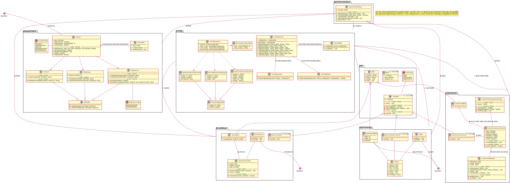

# Bericht zum Meilenstein 2
## UML-Diagramm:

---
## Was ist seit dem letzten Meilenstein passiert ?
- Besprechung am 03.11.2021 über die Vorgehensweise für diesen Meilenstein -> Entscheidung PlantUML für Meilenstein 03 zu nutzen
- Veränderungen innerhalb der Rollenaufteilung 
- Erstellung der PlantUML Templates
- Einarbeitung und Hilfe in PlantUML durch Gruppenmitglieder
- In manchen Gruppen Umstrukturierung der zuvor ausgearbeiteten Struktur in den CRC-Karten
- Ausarbeitung der Moduldiagramme mit Hilfe von PlantUML, Visual Studio Code und LiveShare
- Review durch andere Gruppenmitlgieder und eventuelle Verbesserungen

## Was waren die Herausforderungen und Probleme ? Wie wurden sie gelöst ?
- Bei der bisherigen Rollenaufteilung hatten zwei Mitglieder weniger mit den Modulen zu tun als Andere, da sie bei der Dokumentation eingeteilt waren -> Entschluss, dass diese Mitglieder wöchentlich in andere Module eingeteilt und durch ein bisheriges Mitglied dieser Modulgruppen bei der Dokumentation gedeckt werden
- Struktur der CRC-Karten musste in manchen Modulgruppen verändert werden -> Ausarbeitung innerhalb der Modulgruppen, Schnittstellen zu anderen Modulen wurden wieder mit deren Modulgruppen besprochen
- Für die Meisten war PlantUML ein zuvor unbekanntes Tool -> Erstellung von Templates, sodass ein leitender Rahmen gegeben war sowie Hilfe bei der Umsetzung durch andere Gruppenmitglieder
- Zeitgleiche Arbeit an dem selben PlantUML Code für ein Modul -> Erstellung der jeweiligen PlantUML Codes mit Hilfe von Visual Studio Code und LiveShare, sodass das zeitgleiches Arbeiten an einem Dokument einfacher wurde
- Einen zentralen Begriff (Interfaces) innerhalb der Aufgabenstellung missverstanden -> Absprache mit anderen Gruppen, neue Interpretation innerhalb der gesamten Gruppe besprochen und Ausarbeitungen angepasst

## Was lief gut ? Was lief nicht gut ?
| gut | nicht gut |
| --- | --------- |
|Entwurf der Klassen war aufgrund guter Vorarbeit (CRC-Karten) gut machbar|In manchen Gruppen musste die bei den CRC-Karten überlegte Struktur nochmals abgeändert werden|
|Gute Kommunikation innerhalb der Modulgruppen sowie der gesamten Gruppe|Interfaces falsch verstanden rip|
|Gleichzeitiges Arbeiten an einem Dokument mit Hilfe von VSC und LiveShare||
|Arbeit mit PlantUML war nach kurzer Einarbeitungsphase schnell und einfach     |Bestimmung der Datentypen gewisser Attribute und Methoden           |

## Was haben Sie gelernt ?
- Nutzung von PlantUML
- Grobe Strukturen (CRC) spezifizieren und gegebenenfalls nochmals abändern
- Einabeitung in neue Modulgruppen, bzw. andere Gruppenmitglieder beim Einarbeiten unterstützen

## Was würden sie beim nächsten Mal anders machen ?
- Bei Unklarheiten bzgl. einiger Begriffe (hier: Interfaces) sich zu Beginn mit anderen Gruppen absprechen um so unnötige Arbeit und nachträgliche Veränerungen zu vermeiden

---
## Teilnehmer und Rollen.

- Verteilung der Aufgaben:
    | Aufgabe        | Team           | Review         |
    | -------------- | -------------- | -------------- |
    | Config File    | Josh, Joni     | Justin, Nils   |
    | Zoom Maps      | Sarah, Josh    | Philip, Justin |
    | Code Charts    | David, Joni    | Sarah, Josh    |
    | Eyetracking    | Nils, David    | Josh, Joni     |
    | Speichermedium | Justin, Nils   | David, Joni    |
    | Analyseclient  | Philip, Justin | Nils, David    |
    | Dokumentation  | Philip, Sarah  | alle           |
