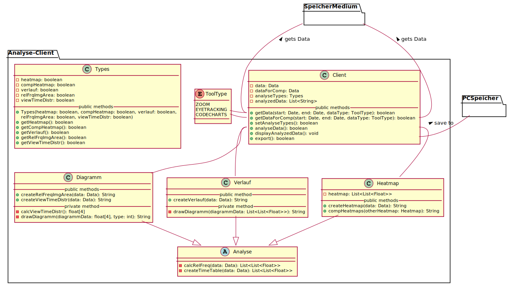

# UML Diagramm Datenanalyse Client

---
## Notizen
- Klasse Client mit zentraler Verantwortlichkeit (zentrale Darstellung)
    - Verwaltung im ClientGUI mit graphischer Benutzeroberfläche für Ein - und Ausgaben
    - Export erfolgt als Datei an das System
- Speicherung der ausgewählten Analysetypen im Client mittels Liste von Enumeration (AnalyseType)
    - nur Speicherung der Typen, die wirklich ausgewählt wurden (bei Liste von Boolean, müssten auch die nicht ausgewählten Typen einen Speicherplatz bekommen)
    - keine extra Klasse mit Setter- und Getter-Methoden notwendig, sondern nur Enumeration der Analyse-Typen 
- Package Util mit ToolType und Data ist unabhängig von dem Analyse-Client, sodass von überall auf dieses zugegriffen werden kann
    - Klasse Data ist parametrisiert mit dem ToolType, da die Daten abhängig vom ToolType unterschiedliche Bedeutungen haben (einfache Erkennung, zu welchem ToolType die Daten angehören)
- Analyse-Klassen sind vom Client abhängig, da dieser die Daten bereitstellt und die fertige Analyse erhält (untergeordnete Darstellung)
