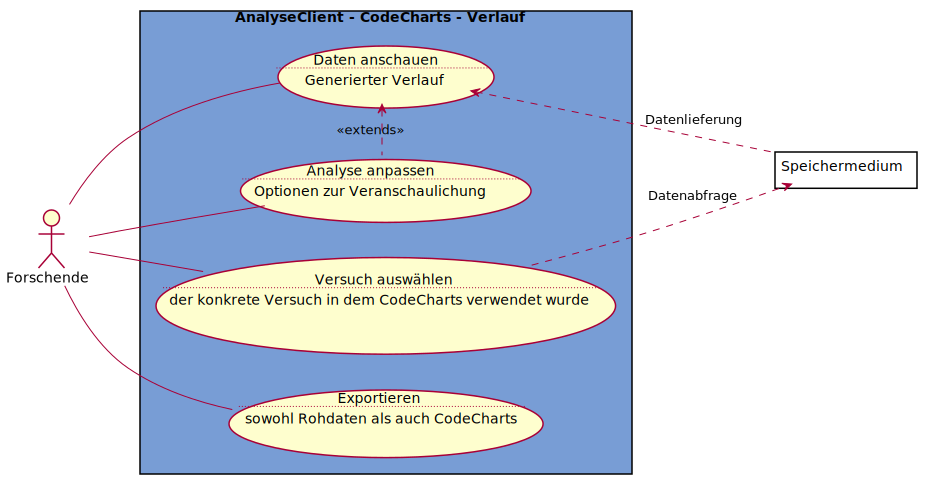

# Use-Case-Diagramm AnalyseClient - CodeCharts - Verlauf
Es wird davon ausgegangen, dass die zu analysierenden Versuche CodeCharts-Versuche sind, und als Analysemethode Verlauf verwendet wird

---
## Notizen
