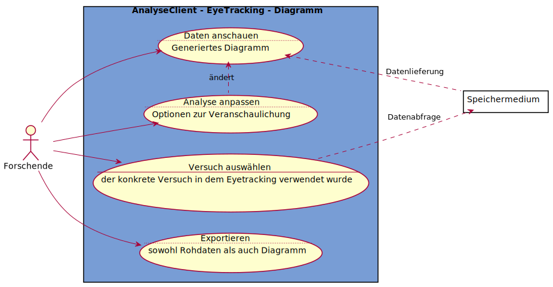

# Use-Case-Diagramm AnalyseClient - EyeTracking - Diagramm
Es wird davon ausgegangen, dass die zu analysierenden Versuche EyeTracking-Versuche sind, und als Analysemethode ViewTimeDistr verwendet wird

---
## Notizen
