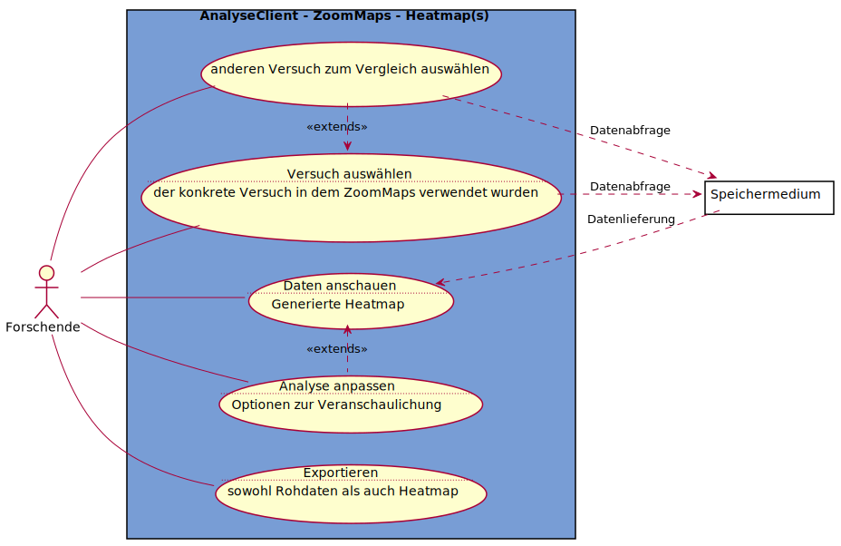

# Use-Case-Diagramm AnalyseClient - ZoomMaps - Heatmap(s)

Es wird davon ausgegangen, dass die zu analysierenden Versuche ZoomMaps-Versuche sind, und als Analysemethode Heatmaps verwenden werden  

---
## Notizen
